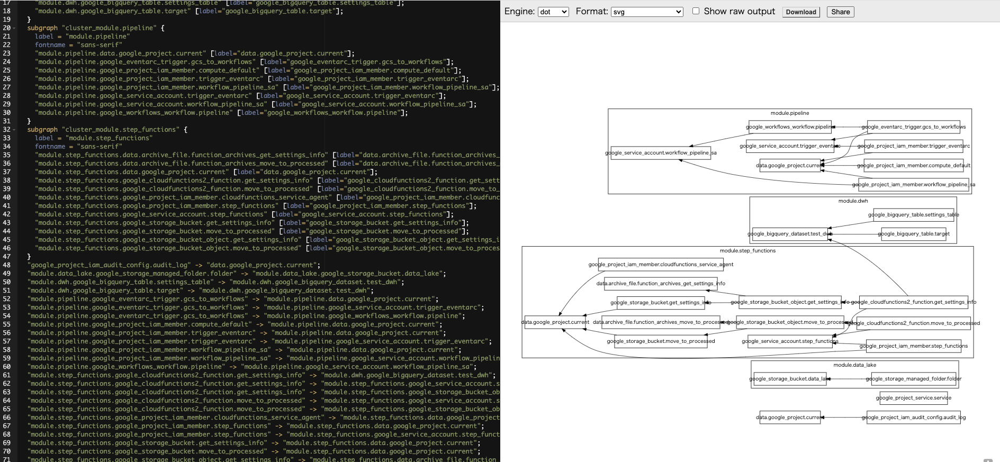

### Terraformをインストールする（バージョンマネージャを使うと良い）

- Linuxのインストール方法は[こちら](https://developer.hashicorp.com/terraform/tutorials/aws-get-started/install-cli#install-terraform)
- バージョンマネージャの[参考情報](https://zenn.dev/terraform_jp/articles/2024-08-22_terraform_version_manager)
  - 私は昔ながらのtfenvを使っている

### Googleプロバイダをセットアップし、自分の Google Cloud プロジェクトに対して terraform init してみよう

https://github.com/shunsuke-tsumori/study_terraform/blob/main/chapter2/src/main.tf#L1-L14

### GCS バケットを作成してみよう

https://github.com/shunsuke-tsumori/study_terraform/blob/main/chapter2/src/main.tf#L16-L19

### localsやvariableを使って値を設定してみよう

`variables`
https://github.com/shunsuke-tsumori/study_terraform/blob/main/chapter2/src/variables.tf#L1-L3
https://github.com/shunsuke-tsumori/study_terraform/blob/main/chapter2/src/main.tf#L12

`locals`
https://github.com/shunsuke-tsumori/study_terraform/blob/main/chapter2/src/locals.tf#L1-L3
https://github.com/shunsuke-tsumori/study_terraform/blob/main/chapter2/src/main.tf#L21

### あるリソースの出力変数を、別のリソースの設定値として入力してみよう（BQデータセット + テーブルが簡単？）
https://github.com/shunsuke-tsumori/study_terraform/blob/main/chapter2/src/main.tf#L31

### lifecycleで削除保護をかけてみよう
https://github.com/shunsuke-tsumori/study_terraform/blob/main/chapter2/src/main.tf#L34-L36

参考: https://developer.hashicorp.com/terraform/tutorials/state/resource-lifecycle#prevent-resource-deletion

### terraform destroyで後片付けをしよう

### (Cloud Runサービス + ロードバランサーなど)

### 依存リソースを作ってterraform graphを実行してみよう。結果を[GraphvizOnline](https://dreampuf.github.io/GraphvizOnline/)などで確認しよう

### .gitignoreすべきファイルを決めて、.gitignoreファイルを作ろう
https://github.com/shunsuke-tsumori/study_terraform/blob/main/.gitignore

- [参考（Terraform.gitignore）](https://github.com/github/gitignore/blob/main/Terraform.gitignore)
